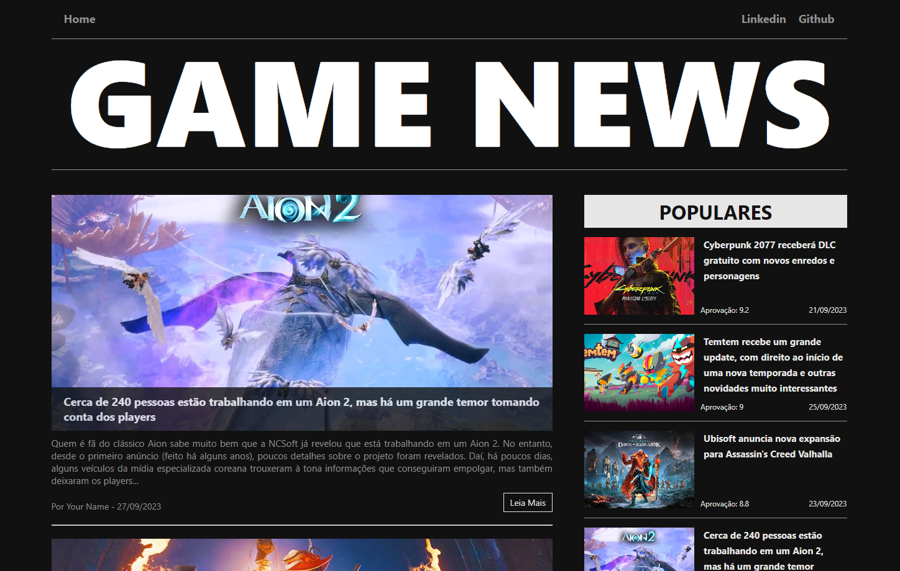

# 🎮 Game News Site

Este projeto é um site de notícias de jogos desenvolvido com Angular e TypeScript. Ele foi inspirado por um design que encontrei no Dribbble e serve como uma plataforma para aprimorar e demonstrar minhas habilidades em desenvolvimento web.

## 🚀 Demonstração

Veja o projeto ao vivo [aqui](https://game-news-mg.vercel.app/).

## 🎨 Design de Referência

O design deste projeto foi inspirado por [este design no Dribbble](https://dribbble.com/shots/18089191-Blog-Layout).

## 🛠️ Tecnologias Utilizadas

- Angular
- TypeScript
- HttpClient (para simulação de requisições à API)

## 🌟 Recursos

- **BigCards e SmallCards**: Estes componentes exibem notícias com uma imagem, título, descrição, nome do autor e data.
- **Scroll Infinito**: Ao rolar até o final da página, mais notícias são carregadas automaticamente, simulando uma experiência de "scroll infinito".
- **Página de Conteúdo Detalhado**: Ao clicar em uma notícia, o usuário é redirecionado para uma página com detalhes completos.

## 📦 Simulação de API

Para simular o recebimento de dados de uma API, utilizei um arquivo `data.json` que contém todas as informações das notícias. Isso foi feito para preparar a estrutura do projeto para futuras integrações com APIs reais e para demonstrar a capacidade de trabalhar com dados dinâmicos em Angular.

## 🛤️ Roteamento

Este projeto utiliza o sistema de roteamento do Angular para navegar entre diferentes páginas:

- **Home**: A página inicial que exibe as notícias. Acessível através da rota base (`/`).
- **Content**: Uma página de detalhes que exibe informações completas sobre uma notícia específica, incluindo um vídeo relacionado. Acessível através da rota `/content/:id`, onde `:id` é o identificador único da notícia.

## 🧩 Componentes e Estrutura

O projeto é composto por vários componentes que juntos formam a interface e a funcionalidade do site:

- **MenuBarComponent**: Barra de menu superior do site.
- **MenuTitleComponent**: Título ou cabeçalho do menu.
- **BigCardComponent**: Componente de notícia em destaque.
- **SmallCardComponent**: Componente de notícia em formato reduzido.
- **HomeComponent**: Página inicial do site.
- **FooterComponent**: Rodapé do site.
- **ContentComponent**: Página de conteúdo detalhado de uma notícia.
- **PopularNewsComponent**: Componente que exibe notícias populares.

## 📦 Módulos e Funcionalidades

O projeto utiliza vários módulos do Angular para fornecer funcionalidades específicas:

- **BrowserModule**: Permite a execução do aplicativo em um navegador.
- **AppRoutingModule**: Fornece roteamento para navegar entre diferentes componentes ou páginas.
- **HttpClientModule**: Permite a realização de requisições HTTP, usado neste projeto para simular a obtenção de dados de uma API através de um arquivo JSON.

